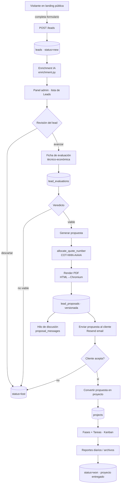
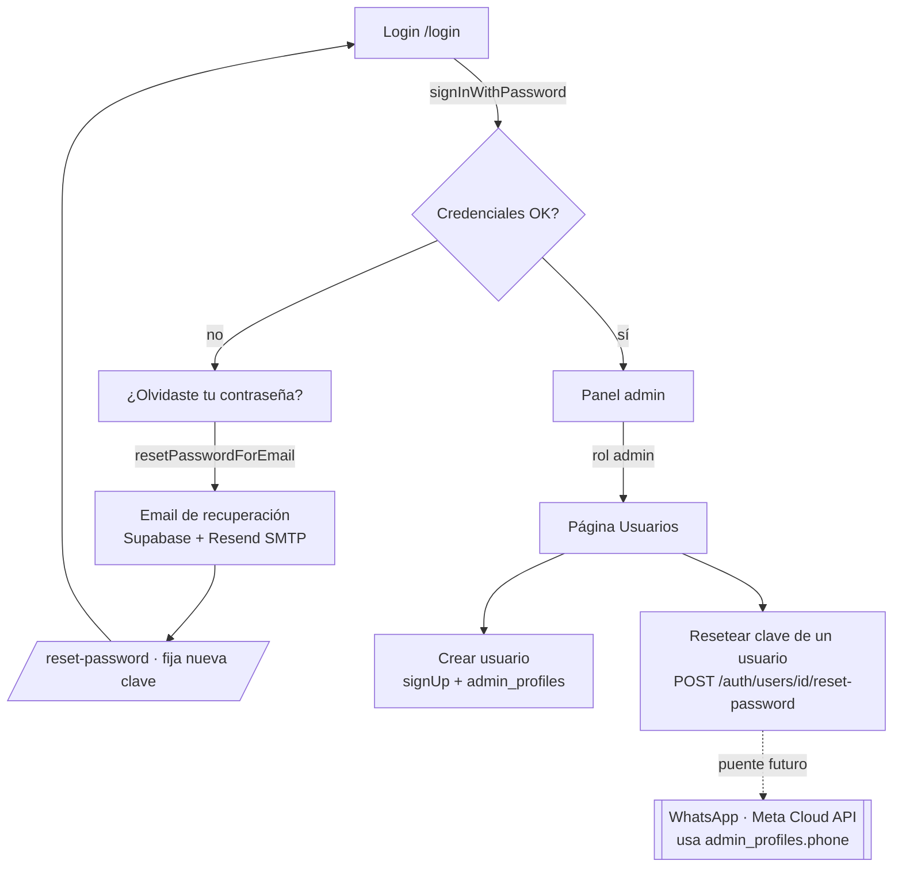
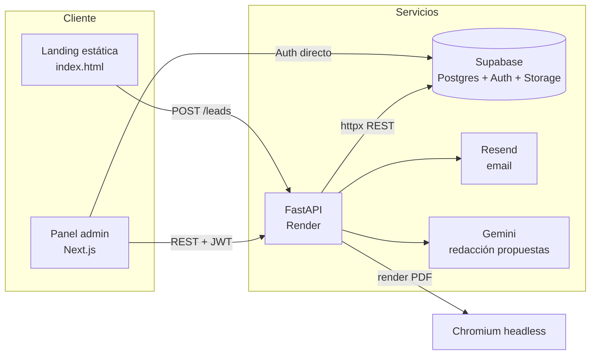

# Diagrama de flujo — SG Sustenta Futuro

Recorrido funcional del sistema, de punta a punta: desde que un visitante llega a
la landing hasta que un proyecto ganado se ejecuta en el panel. GitHub renderiza
el Mermaid automáticamente.

## 1. Flujo principal: de visitante a proyecto entregado

## 2. Autenticación y gestión de usuarios

## 3. Arquitectura de despliegue

## Módulos y rutas clave

| Módulo | Frontend (admin) | Backend (FastAPI) |
|---|---|---|
| Captación de leads | landing `index.html` (form) | `routers/landing.py`, `routers/leads.py` |
| Revisión de leads | `app/leads/…` | `routers/leads.py` |
| Ficha de evaluación | `app/leads/[id]/EvaluationSection.tsx` | `routers/evaluations.py` |
| Propuestas + PDF | `app/propuestas/[leadId]` | `routers/proposals.py`, `proposal_render.py` |
| Proyectos + Kanban | `app/proyectos`, `app/kanban` | `routers/projects.py` |
| Usuarios + recuperación | `app/usuarios`, `app/login`, `app/reset-password` | `routers/auth.py` |
