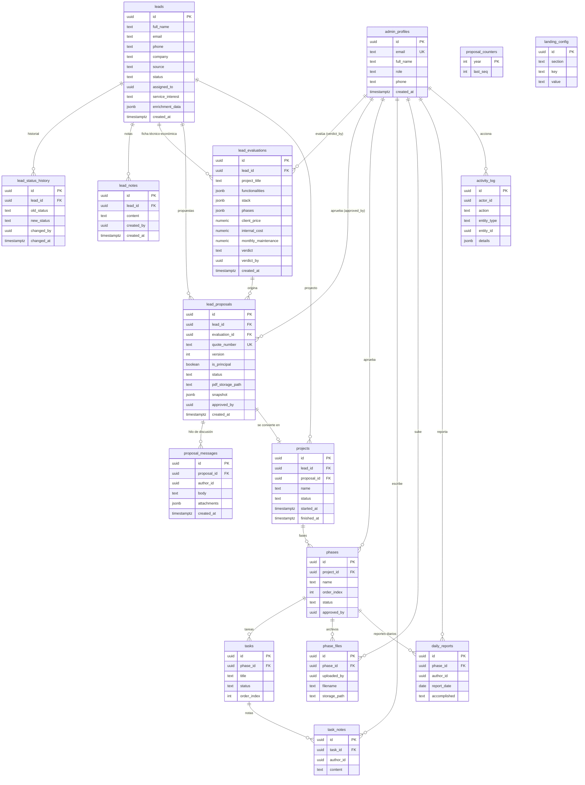

# Diagrama relacional — SG Sustenta Futuro

Modelo de datos del sistema (Supabase Postgres, esquema `public`). Generado desde
el esquema real de la base. GitHub renderiza el diagrama Mermaid automáticamente.

> Convención: `PK` clave primaria · `FK` clave foránea · `UK` único.
> `assigned_to` en `leads` referencia a `admin_profiles` de forma lógica (sin
> constraint dura).



## Módulos por grupo de tablas

| Grupo | Tablas | Rol |
|---|---|---|
| **Usuarios / auth** | `admin_profiles` | Perfiles internos (`admin` / `user`), teléfono para recuperación WhatsApp |
| **Leads (captación)** | `leads`, `lead_status_history`, `lead_notes` | Lead desde la landing, historial de estados y notas internas |
| **Evaluación + propuestas** | `lead_evaluations`, `lead_proposals`, `proposal_counters`, `proposal_messages` | Ficha técnico-económica, propuestas versionadas con número COT y hilo de discusión |
| **Proyectos (delivery)** | `projects`, `phases`, `tasks`, `task_notes`, `phase_files`, `daily_reports` | Ejecución del proyecto ganado: fases, tareas (Kanban), archivos y reportes |
| **Sistema** | `activity_log`, `landing_config` | Auditoría de acciones y configuración editable de la landing |

## Estados del lead (columna `leads.status`)

```
new → reviewing → pending_approval → contacted → evaluating → viable → proposal_sent → won / lost
```
